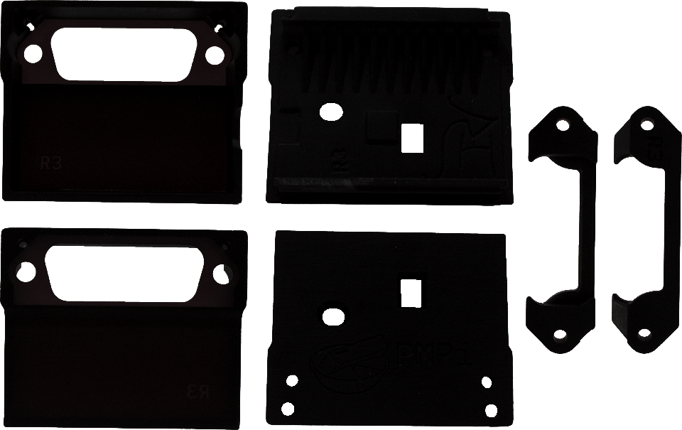
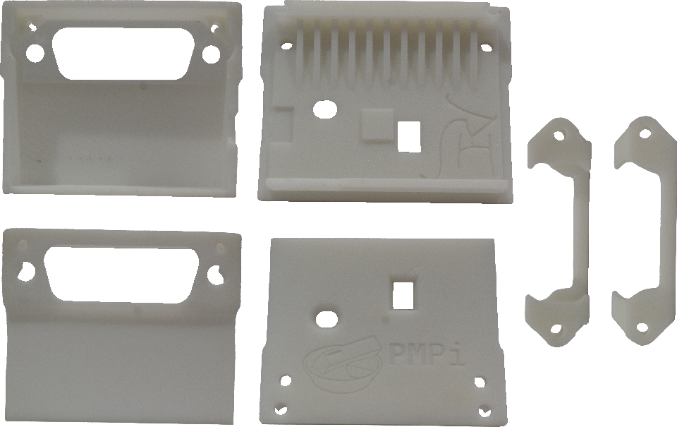
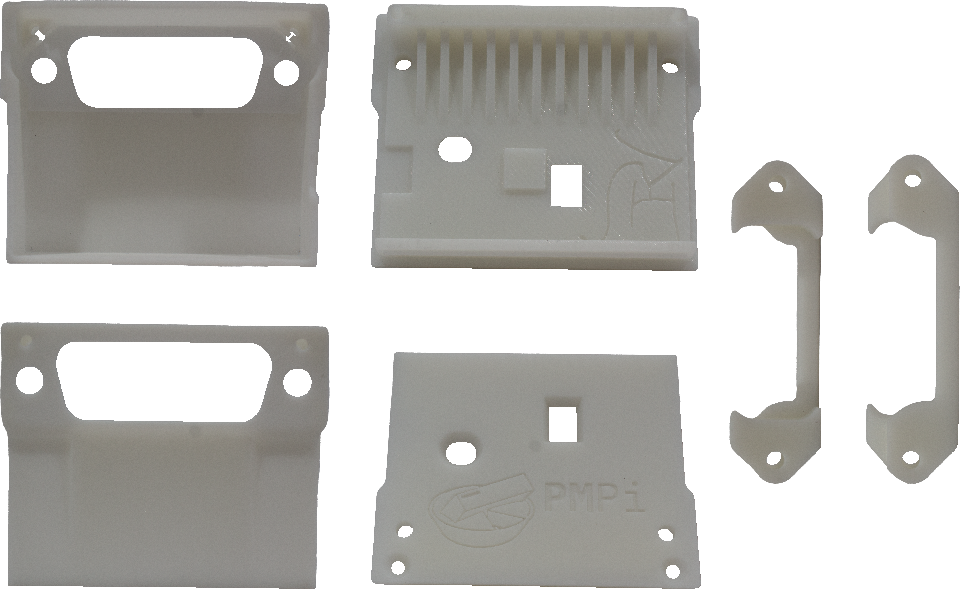
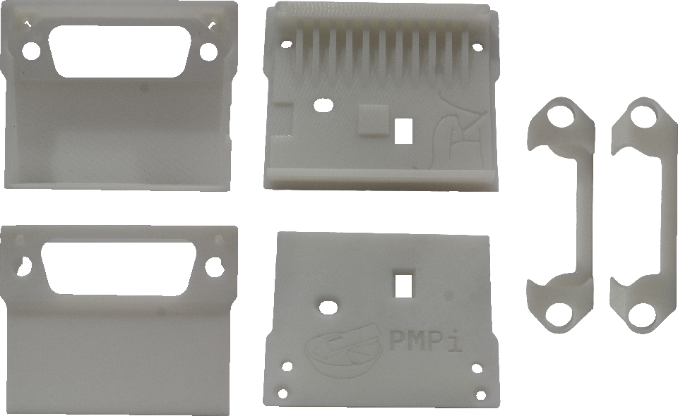

<!-- PROJECT: PMPi -->
<!-- TITLE: PMPi-Case -->
<!-- FONT: IBM Plex -->
<!-- KEYWORDS: SLA, 3D Print, Hardware -->
<!-- TECHNOLOGY: Solidworks -->
<!-- STATUS: Work In Progress -->

[About](#about) - [Usage](#usage) - [Gallery](#gallery) - [License](#license)

## Status

**`Work In progress`**
> *Still working with prototype prints - July 2024*

## About
<!-- DESCRIPTION START -->
This is the CAD repository for the PMPi Project's Case, a wireless PM2813 GPIB Controller using a Raspberry Pi Pico W.

Please refer to the [parent repository](https://github.com/LeHuman/PMPi)
<!-- DESCRIPTION END -->

### Note

Due to the binary nature of CAD files, version control is just copy/paste of entire files. Because of this, earlier versions have been lost and history on this repository may be purged to reduce repository size.

## Usage

This project is made in Solidworks. Look at the release page for a STEP file version of this project.

The project was prototyped against [JLC3DP](https://jlc3dp.com/)'s manufacturing capabilities. It is not necessary designed for mass manufacturing, as cosmetic defects will still occur.

### Note

To reduce file size, the top assembly is saved with suppressed components. Solidworks is old and weird.

### Requirements

- [Solidworks](https://www.solidworks.com/) >= 2023 SP2.1

## Gallery

Physical revisions of the PMPi-Case

<!-- ### R4
 \
*Revision 4 of the PMPi Case* \
*Accounted for SMD caps. Added copyright info and insignia to each part.* -->

### R3

 \
*Revision 3 of the PMPi Case* \
*Added revision mark. Printed in black. Manual sanding for unaccounted SMD caps.*

### R2

 \
*Revision 2 of the PMPi Case* \
*Adjusted thickness for better printing. Manual sanding for unaccounted SMD caps.*

### R1

 \
*Revision 1 of the PMPi Case* \
*Added a locking tab and removed the need for a spacer.*

### R0

 \
*Revision 0 of the PMPi Case* \
*Initial test for printing.*

## License

CERN Open Hardware Licence Version 2
